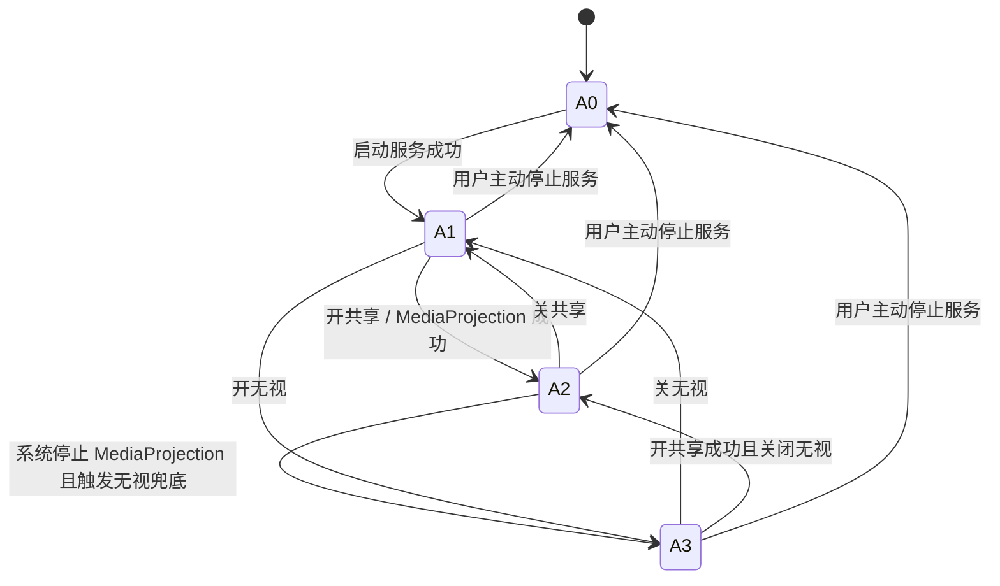
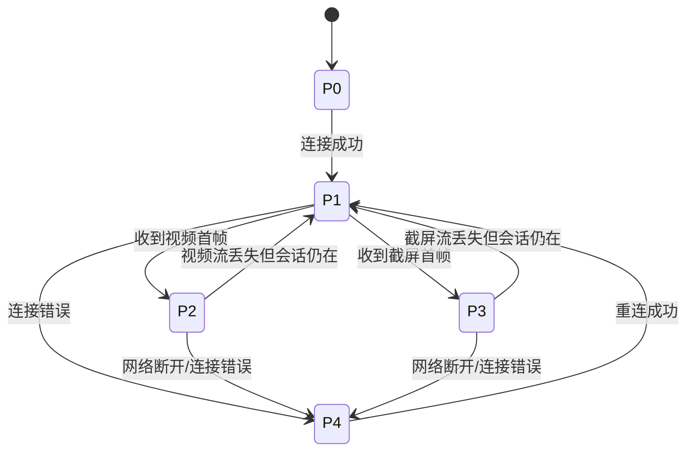

# Android 锁屏 / 断网 / 关共享 / 开共享 状态机

> 最后复核：2026-04-09  
> 目的：把 Android 端服务、画面流、PC 重连之间的真实状态机固定下来，后续修改必须先对照这份文档。

---

## 1. 总览

这个项目现在不是“单一画面状态”，而是两层状态同时存在：

1. **服务状态**
   - App / MainService / 无障碍 / 悬浮窗是否还活着
2. **画面状态**
   - 视频流是否还在
   - 无视截屏流是否可用
   - PC 当前是否已经收到首帧

核心原则：

- **服务存活** 不等于 **视频流存活**
- **视频流丢失** 不应该直接等于 **服务停止**
- **PC 等待首帧** 不应该阻断 Android 侧控制按钮

---

## 2. Android 主状态

### 2.1 服务层状态

| 状态 | 含义 |
|---|---|
| `A0 服务停止` | MainService 未运行，PC 不可连接 |
| `A1 服务存活-待命` | MainService 存活，`_isReady=true`，但当前没有视频流 |
| `A2 服务存活-视频流中` | MainService 存活，MediaProjection 存在，视频流可产出 |
| `A3 服务存活-无视截屏中` | MainService 存活，视频流不可用，但无视截图循环在跑 |

### 2.2 PC 侧画面状态

| 状态 | 含义 |
|---|---|
| `P0 未连接` | PC 未连接到 Android |
| `P1 已连接-等待首帧` | 会话连上，但还没收到视频帧或截屏帧 |
| `P2 已连接-视频帧中` | PC 正在接收 MediaProjection 视频流 |
| `P3 已连接-截屏帧中` | PC 正在接收无视截屏流 |
| `P4 重连中` | 连接错误后已进入持续自动重连 |

---

## 3. 关键状态变量

### Android 侧

| 变量 | 文件 | 作用 |
|---|---|---|
| `_isReady` | `DFm8Y8iMScvB2YDw.kt` | 服务是否对外可用 |
| `_isStart` | `DFm8Y8iMScvB2YDw.kt` | 是否处于共享视频流状态 |
| `mediaProjection` | `DFm8Y8iMScvB2YDw.kt` | 当前录屏授权对象 |
| `shouldRun` | `common.kt` / `nZW99cdXQ0COhB2o.kt` | 无视截图循环是否运行 |
| `SKL` | `common.kt` / `nZW99cdXQ0COhB2o.kt` | 穿透模式是否运行 |
| `PIXEL_SIZEBack8` | `pkg2230.rs` / `ffi.rs` | 无视帧是否允许上送，`0` 允许，`255` 丢弃 |
| `VIDEO_RAW` | `pkg2230.rs` / `ffi.rs` | Android 原始画面帧出口 |

### PC 侧

| 变量 | 文件 | 作用 |
|---|---|---|
| `waitForFirstImage` | `model.dart` | 是否仍在等首帧 |
| `waitForImageTimer` | `model.dart` | 10 秒无首帧自动开无视 |
| `_androidAutoReconnectTimer` | `model.dart` | Android 连接错误后的持续自动重连 |
| `waitForImageDialogShow` | `model.dart` | 等待画面提示框显示状态 |

---

## 4. 状态图

---

## 5. 事件 -> 转移规则

### 5.1 开共享

前提：

- Android 服务已运行，处于 `A1` 或 `A3`

流程：

1. 调用 `restoreMediaProjection()`
2. 若已有可复用授权，则直接恢复 MediaProjection
3. 若授权不可复用，则请求新的 MediaProjection 权限
4. 真正拿到 MediaProjection 后：
   - 关闭无视循环
   - 设 `PIXEL_SIZEBack8=255`
   - 启动视频流

结果：

- Android：`A1/A3 -> A2`
- PC：后续收到视频首帧后进入 `P2`

---

### 5.2 关共享

流程：

1. 调用 `killMediaProjection()`
2. 停止并释放 MediaProjection、VirtualDisplay、ImageReader、Encoder、Surface
3. 保持 `_isReady=true`
4. 调用 `startIgnoreFallback("kill-media-projection")`
   - 打开 `VIDEO_RAW`
   - 设 `PIXEL_SIZEBack8=0`
   - 请求无视截图循环

结果：

- Android：`A2 -> A3`
- PC：视频流丢失后应等待截屏首帧，收到后进入 `P3`

注意：

- 关共享不等于停服务
- 关共享不应该走 `stopForeground(true)` 或 `stopSelf()`

---

### 5.3 锁屏

当前策略：

1. `ACTION_SCREEN_OFF` 时不主动停 MediaProjection
2. 只刷新：
   - 前台通知
   - CPU wakelock
   - WiFi lock
   - 悬浮窗保活
3. 若系统随后真的让 `mediaProjection == null` 或触发 `MediaProjection.onStop()`：
   - 释放视频资源
   - 切换无视截图兜底

分支结果：

- **系统锁屏后视频流仍可继续**
  - Android 保持 `A2`
  - PC 保持 `P2`
- **系统锁屏后释放 MediaProjection**
  - Android `A2 -> A3`
  - PC `P2 -> P1 -> P3`

---

### 5.4 断网 / 切网络

Android 当前策略：

- 刷新保活，不主动停服务
- 若当前没有 MediaProjection，则继续保持无视兜底链路

PC 当前策略：

1. 底层连接错误上报
2. 进入持续自动重连
3. 重连成功后进入 `P1`
4. 若 10 秒无首帧，则自动发送一次“开无视”

结果：

- Android 侧目标状态：服务仍在 `A1/A2/A3`
- PC 侧目标状态：`P4 -> P1 -> P2/P3`

---

## 6. Android 10 与 Android 11-16 的分界

这是当前最重要的兼容边界。

### Android 11-16

- 可使用 `AccessibilityService.takeScreenshot()`
- 视频流丢失后可以切到无视截屏流
- 理想目标是：
  - 服务不断
  - 视频流没了也能退到截屏流

### Android 10

- 当前代码里无视截图循环在 `Build.VERSION < R` 时直接返回
- 也就是说 Android 10 **没有同等级的无视截屏流兜底**

实际含义：

- Android 10 上如果锁屏导致 MediaProjection 被系统释放：
  - 服务可以尽量保活
  - 但不能承诺像 Android 11-16 那样稳定切到截屏流

这不是文档口径问题，而是当前代码真实边界。

---

## 7. PC 等待画面规则

### 当前规则

1. 连接成功后进入 `P1`
2. 保留等待画面提示框
3. Android 侧按钮应始终位于提示框上层
4. 10 秒仍无首帧：
   - 自动发送一次“开无视”
5. 收到任意一种首帧：
   - 视频帧
   - 截屏帧
6. 都要统一清理：
   - `waitForFirstImage`
   - `waitForImageTimer`
   - 等待画面提示框

### 目标原则

- PC 不能只死等视频流
- PC 也不能把“等待画面”做成阻断控制的死层

---

## 8. 功能按钮的状态机约束

| 按钮 | 允许改变的状态 | 不允许改变的状态 |
|---|---|---|
| 开共享 | `A1/A3 -> A2` | 不应停止服务 |
| 关共享 | `A2 -> A3` | 不应停止服务 |
| 开无视 | `A1/A2 -> A3` | 不应停止服务 |
| 关无视 | `A3 -> A1` 或等待开共享恢复到 `A2` | 不应停止服务 |
| 开黑屏/关黑屏 | 只改 overlay 触摸与显示 | 不应影响服务和画面流 |
| 开穿透/关穿透 | 只改 `SKL` 及穿透绘制链路 | 不应影响服务 |

---

## 9. 后续修改铁律

以后凡是改下面事件之一，必须同时检查：

- 锁屏
- 亮屏
- 断网
- 重连
- 开共享
- 关共享
- 开无视
- 关无视
- 等待首帧
- 停止服务

至少要确认这三件事：

1. 有没有把服务状态和视频流状态重新绑死
2. 有没有让 PC 再次只等视频流
3. 有没有让等待画面提示挡住 Android 侧按钮

---

## 10. 当前仍然存在的真实边界

- Android 10 没有 Android 11-16 那样的无视截图 API 兜底
- 第三方 App 无法做到微信那种系统级绝对白名单保活
- ROM 若直接强杀进程并关闭无障碍，应用无法静默重新打开无障碍

所以当前能追求的是：

- **不因为我们自己的代码逻辑把服务停掉**
- **不因为等待画面 UI 把恢复链路卡死**
- **在系统释放视频流时尽可能退到截屏流**

